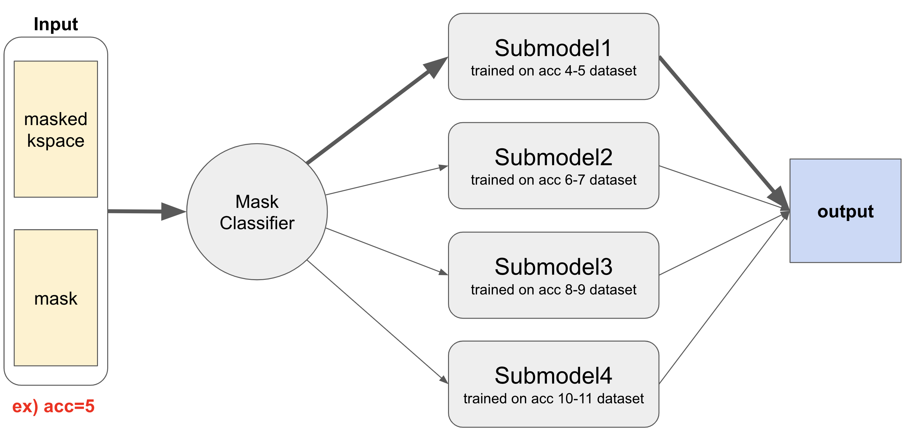
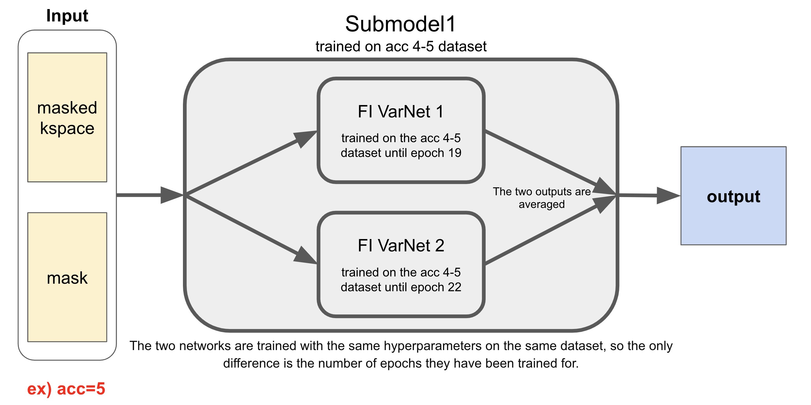
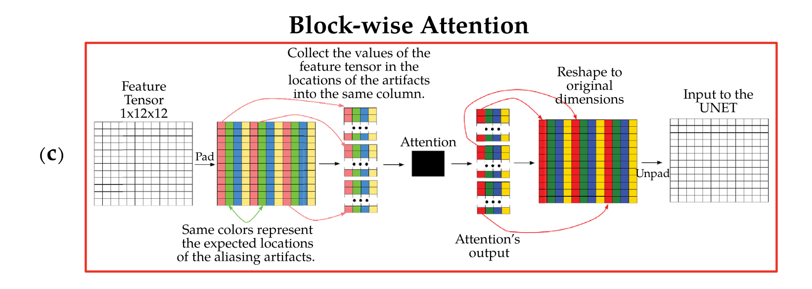
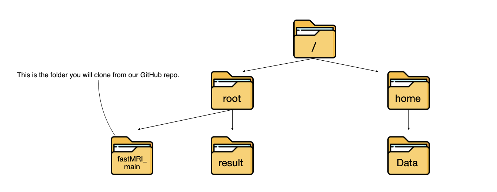
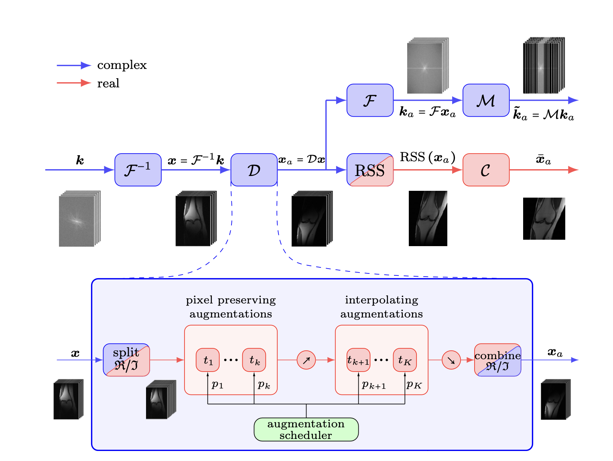
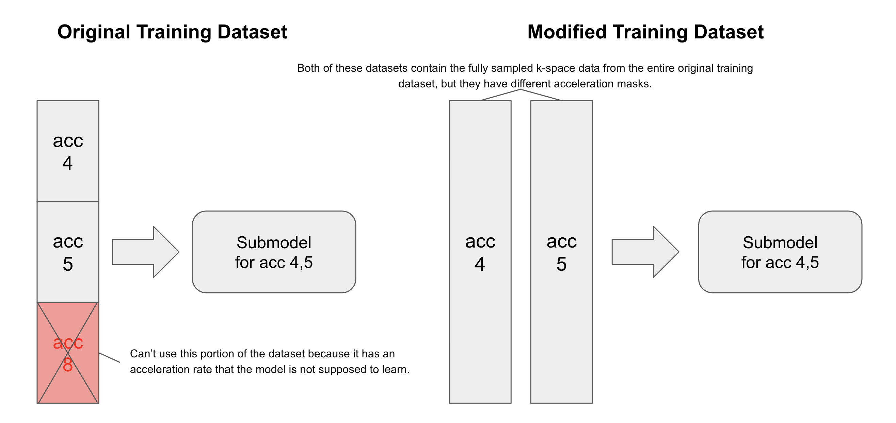

# 2024 SNU FastMRI_challenge
[2024 SNU FastMRI challenge](https://fastmri.snu.ac.kr/) is a challenge hosted by Professor [Jong-Ho Lee](https://ece.snu.ac.kr/research-faculty/faculty/full-time?md=view&profid=p077)’s [LIST lab](https://list.snu.ac.kr/home) at Seoul National University. This competition is based on [Facebook AI's FastMRI challenge](https://web.archive.org/web/20230324102125mp_/https://fastmri.org/leaderboards), but with different conditions. Below are the new conditions added by SNU FastMRI Challenge.
* 8GB VRAM
* Only multi-coil brain datasets
* More types of acceleration
  - Train dataset : 4X, 5X, 8X
  - Valid dataset : 4X, 5X, 8X
  - Leaderboard dataset : 5X, 9X
  - Test dataset : (not revealed)
    - The top teams on the leaderboard will be tested on the test dataset to determine the final rankings.
* Smaller training dataset (4X : 118 people, 5X : 118 people, 8X : 120 people)
* Can not use pretrained model
* Limited inference time (3,000 seconds)

You can check SNU FastMRI challenge's baseline models and codes [here](https://github.com/LISTatSNU/FastMRI_challenge). [E2E VarNet](https://arxiv.org/abs/2004.06688) and UNet were given as baseline models.

[AIRS Medical](https://airsmed.com/en/), which developed AIRS-Net and won the Facebook AI FastMRI Challenge, along with [Klim Ventures](https://www.klimvc.com/), sponsored the challenge.

## What is FastMRI?
FastMRI is accelerating the speed of MRI scanning by acquiring fewer measurements. This may reduce medical costs per patient and improve patients' experience. However, its resolution is very low, so deep learning technology is widely applied to enhance the resolution of FastMRI. In this challenge, we aim to develop a model that can reconstruct images from undersampled measurements in FastMRI.

## SuperFastMRI team
We participated in the 2024 SNU FastMRI Challenge as a two-person team named **SuperFastMRI**.

### Team Members
* Dongwook Kho
  - Undergraduate in the Department of Electrical and Computer Engineering, Seoul National University
  - Email : kho2011@snu.ac.kr, khodong2014@gmail.com
  - github : [KhoDongwook](https://github.com/KhoDongwook)
* Yoongon Kim
  - Undergraduate in the Department of Electrical and Computer Engineering, Seoul National University
  - Email : yoon_g_kim@snu.ac.kr, yooongonkim@gmail.com
  - github: [Yoongon-Kim](https://github.com/Yoongon-Kim)

## Our Model
Our model uses MoE strategy with four [Feature-Image (FI) VarNet](https://www.nature.com/articles/s41598-024-59705-0) sub-models. However, due to the 8GB limit on GPU VRAM, we discarded Block-wise Attention in each FI-VarNet sub-model to save memory for more cascades and deeper UNets within the sub-model.



### MoE Strategy
We created submodels specialized for specific acceleration ranges to handle different types of input accelerations. When an input is received, the model calculates its acceleration and forwards it to the submodel specialized for that acceleration. The result is then outputted. If the input’s acceleration is not covered by the ranges of the submodels, it is forwarded to the model with the closest acceleration range.

### Ensemble
Each submodel is created through ensemble techniques. We selected two networks with the lowest and the second-lowest valid loss and combined them using an averaging method. Through numerous experiments, we confirmed that this ensemble approach yielded strong results in the leaderboard evaluation. Each submodel follows the structure shown in the image below.



We created the submodels by assembling the networks as follows.

* Submodel for acc 4 and 5
    * model trained until epoch 24 + model trained until epoch 25

* Submodel for acc 6 and 7
    * didn't applied ensemble due to limited time

* Submodel for acc 8 and 9
    * epoch 23 + epoch 25

* Submodel for acc 10 and 11
    * didn't applied ensemble due to limited time

### Feature-Image VarNet
E2E VarNet, the baseline model, is powerful, but some information is lost in the refinement module. This is basically because the data consistency (DC) module performs updates of a tensor in the 2 channel k-space domain while, in the refinement module, the updates are performed in the feature-space where the tensor's channel number increases upto 32. In the feature-space, we can gain high-level features, but most of them are lost in the process of converting the tensor back into the k-space in order to perform DC module update.





Feature-Image (FI) VarNet resolves this problem by making DC module perform updates of a tensor in the feature-space rather than in k-space. Therefore, the tensor retains a large number of feature channels throughout the network’s cascades. The high-level features which is lost in E2EVarNet's refinement modules are now preserved in FI VarNet.

However, we abandoned Block-attention module in FI VarNet due to the 8GB limit on GPU VRAM. Block-attention module's role is to reduce computational complexity while enhancing the model’s ability to identify spatial locations of aliasing artifacts caused by Cartesian undersampling. After experimenting with various hyperparameters, we reached to a conclusion that getting more cascades and deeper UNets is way more efficient in training than maintaining Block-attention module. We believe that the reason block-wise attention did not improve the model’s performance was because the attention block consumed memory, reducing the size of the base model that needed to be maintained.

## How to Run Our Model

### File System


The `result` folder stores models, validation loss, and reconstructed images obtained from the models.

The `Data` folder stores the training dataset, validation dataset, and leaderboard evaluation dataset.

### Cloning Our Repository

```cmd
git clone https://github.com/superfastmri/fastMRI_main.git
cd /root/fastMRI_main
```
`/root` should be your current working directory before cloning.

### Setting Up the Development Environment
`pip install scikit-image h5py fastmri`

Download these modules before running the following commands

### Training Commands

```python
sh train_45.sh
sh train_67.sh
sh train_89.sh
sh train_1011.sh
```

Each line of code trains a FIVarNet specialized for a specific acc range. For example, the first FIVarNet is trained for acc 4 and 5. Each FIVarNet is saved as `model_acc##.pt` in the `root/result/FIVarNet_submit/checkpoints_acc##` directory.

### Evaluation Commands

```python
sh reconstruct.sh
sh leaderboard_eval.sh
```

`sh reconstruct.sh` saves the reconstructed image files generated by the trained model using the leaderboard evaluation dataset to `root/result/FIVarNet_submit/reconstructions_leaderboard`.

`sh leaderboard_eval.sh` calculates the SSIM value of the reconstructed images created by `sh reconstruct.sh` command.

## Results

### Leaderboard Evaluation Loss
```
Leaderboard SSIM : 0.9804
========== Details ==========
Leaderboard SSIM (public): 0.9867
Leaderboard SSIM (private): 0.9741
```


## Techniques
Here are techniques we applied to enhance the effectiveness of our model’s training.

### MRAugment

[MRAugment](https://arxiv.org/abs/2106.14947) is a data augmentation technique for MRI reconstruction that operates in the image domain. It performs two types of augmentations: pixel-preserving augmentations, which include flipping, translation by integer pixel values, and rotation; and general affine augmentations, which include translation by arbitrary coordinates, arbitrary rotations, scaling, and shearing.

It offers all the benefits of data augmentation to MRI reconstruction models. It can make it possible to achieve the effect of training with a larger dataset even with a small dataset. Through this, it improves generalization to unseen MRI scanners and prevents overfitting issues common in a small dataset settings.

### Data Augmentation through Creating New Masks
Since we used a Mixture of Experts (MoE) strategy that combines submodels specialized for specific accelerations, we had to use data with specific accelerations when training each submodel. However, the challenge organizers provided only one acceleration mask per fully sampled data. As a result, if we used the dataset as it was, we had to use only a small portion of the dataset. To avoid this, we created new masks with various acceleration features, enabling the model to utilize the entire training dataset.



In addition, we anticipated that different masks would result in different data features, so we trained the model while applying two different acceleration masks to the same fully sampled k-space dataset.

## Details

### Gradient Accumulation
Gradient accumulation allows larger batch sizes by accumulating gradients over several mini-batches. Therefore, we believed that gradient accumulation would be particularly effective in the SNU Fast MRI challenge due to the limited GPU memory available. Our batch size was four, with a mini-batch size of one.

### Gradient Clipping
We applied gradient clipping to prevent the gradients growing extremely large by limiting the gradients to a certain value(max norm). Our max norm was 1.0

### LR Scheduler
We utilized **ReduceLROnPlateau** to vaoid overshooting and improve convergence. This reduces the learning rate when the model's performance stops improving. We configured our scheduler to wait for five epochs without improvement in the model’s validation loss before reducing the learning rate by a factor of 0.1.

### Optimizer
We selected **RAdam** as our optimizer because it improves stability during the early stages of training by introducing a rectification term to the commonly used Adam optimizer.

## Reference
[1] Zbontar, J.*, Knoll, F.*, Sriram, A.*, Murrell, T., Huang, Z., Muckley, M. J., ... & Lui, Y. W. (2018). fastMRI: An Open Dataset and Benchmarks for Accelerated MRI. arXiv preprint arXiv:1811.08839.

[2] Sriram, A.*, Zbontar, J.*, Murrell, T., Defazio, A., Zitnick, C. L., Yakubova, N., ... & Johnson, P. (2020). End-to-End Variational Networks for Accelerated MRI Reconstruction. In MICCAI, pages 64-73.

[3] Ronneberger, O., Fischer, P., & Brox, T. (2015, October). U-net: Convolutional networks for biomedical image segmentation. In International Conference on Medical image computing and computer-assisted intervention (pp. 234-241). Springer, Cham.

[4] Giannakopoulos, I. I., Muckley, M. J., Kim, J., et al. (2024). Accelerated MRI reconstructions via variational network and feature domain learning. Scientific Reports, 14(1), 10991. https://doi.org/10.1038/s41598-024-59705-0

[5] Fabian, Z., Heckel, R., & Soltanolkotabi, M. (2021). Data augmentation for deep learning based accelerated MRI reconstruction with limited data (arXiv:2106.14947). https://arxiv.org/abs/2106.14947

[6] Kozodoi, M. (2021, February 19). Gradient accumulation. Kozodoi. https://kozodoi.me/blog/20210219/gradient-accumulation

[7] Pascanu, R., Mikolov, T., & Bengio, Y. (2013). On the difficulty of training recurrent neural networks. In Proceedings of the 30th International Conference on Machine Learning (ICML 2013) (pp. 1310-1318).

[8] PyTorch. (n.d.). torch.optim.lr_scheduler.ReduceLROnPlateau. Retrieved August 19, 2024, from https://pytorch.org/docs/stable/generated/torch.optim.lr_scheduler.ReduceLROnPlateau.html

[9] PyTorch. (n.d.). torch.optim.RAdam. Retrieved August 19, 2024, from https://pytorch.org/docs/stable/generated/torch.optim.RAdam.html
